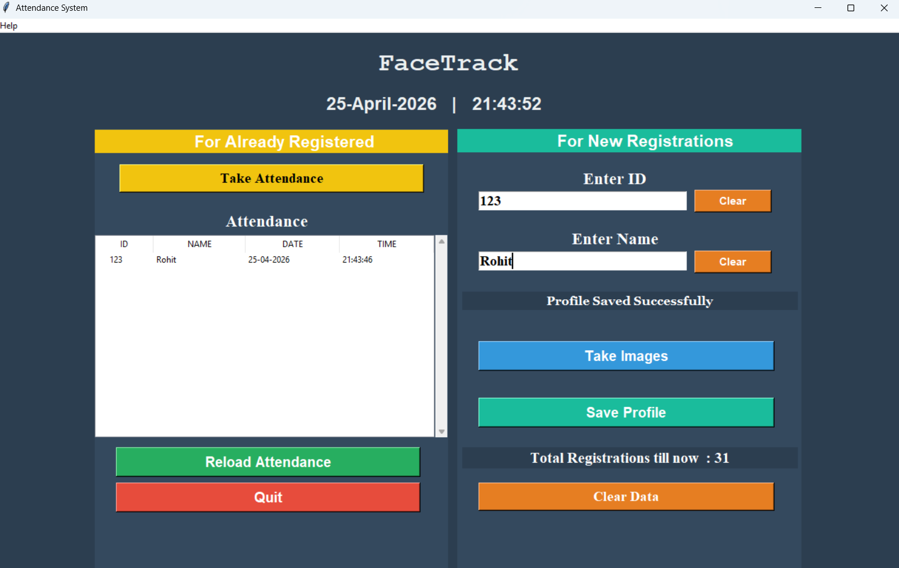

# Face Recognition Attendance System

**Face Recognition Attendance System** built completely on **Python** using **Computer Vision** and **Machine Learning** techniques to automate attendance management with real-time face detection and recognition.

<p align="center">
  
  
  
</p>

---

## Features

- Real-time face detection and recognition
- Automated attendance marking system
- Interactive Python GUI interface
- Capture and train face datasets
- Attendance stored in CSV format
- Password protected system
- Fast and lightweight application

---

## 🚀 Tech Stack

| Technology | Purpose |
|------------|---------|
| Python | Core Programming Language |
| Tkinter | GUI Development |
| OpenCV | Face Detection & Recognition |
| NumPy | Numerical Computation |
| Pandas | Attendance Data Handling |
| CSV | Attendance Storage |
| Haarcascade | Face Detection Model |

---

## 📸 Preview

<p align="center">
  
</p>

<p align="center">
  
</p>

---

## 🧠 How It Works

The application uses **Computer Vision** and **Face Recognition** techniques to:

1. Capture facial images using webcam
2. Detect faces in real-time
3. Train the recognition model
4. Recognize registered users
5. Automatically mark attendance
6. Store attendance records in CSV files

---

## 📂 Project Structure

```bash
face-recognition-attendance-system/
│
├── main.py
├── train.py
├── attendance.csv
├── haarcascade_frontalface_default.xml
├── requirements.txt
├── README.md
├── images/
└── data/
```

---

## ⚙️ Installation

Clone the repository:

```bash
git clone https://github.com/your-username/face-recognition-attendance-system.git
```

Move into the project directory:

```bash
cd face-recognition-attendance-system
```

Install dependencies:

```bash
pip install -r requirements.txt
```

Run the application:

```bash
python main.py
```

---

## 🐍 Python Version

This project works best with:

```bash
Python 3.10
```

---

## 📌 Future Improvements

- 🌐 Cloud-based attendance storage
- 📱 Mobile application integration
- 🤖 Deep Learning face recognition
- 🌙 Dark mode GUI
- 📤 Export attendance as Excel/PDF
- 🔔 Email attendance notifications

---

## 🤝 Contributing

Contributions are welcome!

Feel free to fork this repository and submit a pull request.

---

## 📜 License

This project is licensed under the MIT License.

---

## ⭐ Support

If you liked this project, consider giving it a ⭐ on GitHub!

---

<p align="center">
  Made with ❤️ using Python & OpenCV
</p>